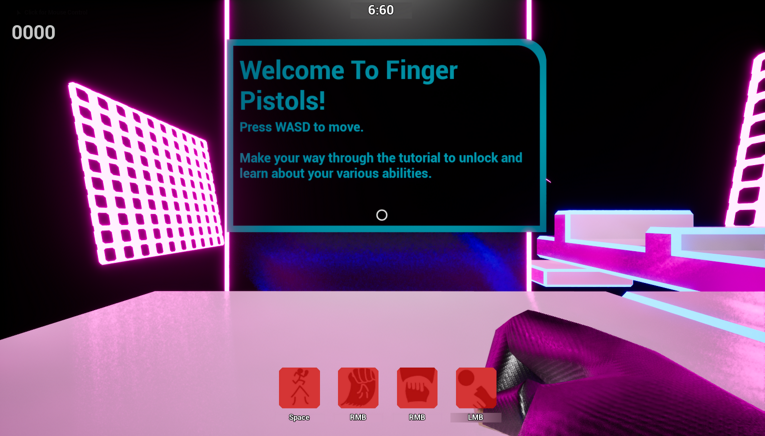
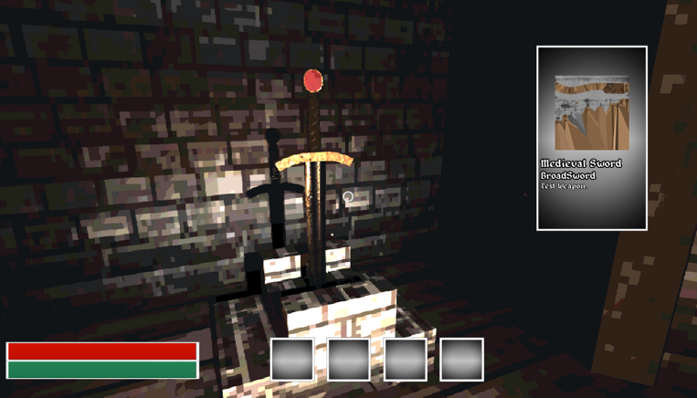

# Education

I'm currently studying at Staffordshire University for a Bachelor's Degree in Games Development, I recently finished my first year in May.

# Portfolio

## Finger Pistols

- Solo project made for university. It's a vertical slice of a speedrunning precision platformer where you shoot obstcles in your environment
  with 'finger pistols' to trigger their affects as if you were physically touching them.

*[You can download the project files for the game here.](https://github.com/The-Ondeveloper/FingerPistols)*

## Decent Dungeon 

- Group project also made for university, I was apart of a group called 'The OK 4'. It's a demo of an RPG dungeon crawler in the same vein as Elder Scrolls, I was the developer for the UI and player character.

*[You can download the project files for the game here.](https://github.com/The-Ondeveloper/Process-Pipeline-Repository)*
