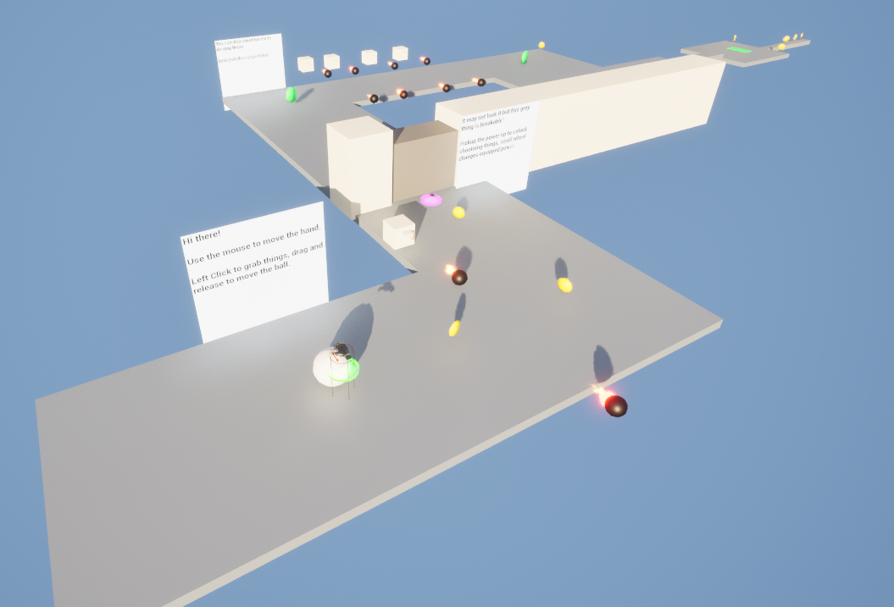
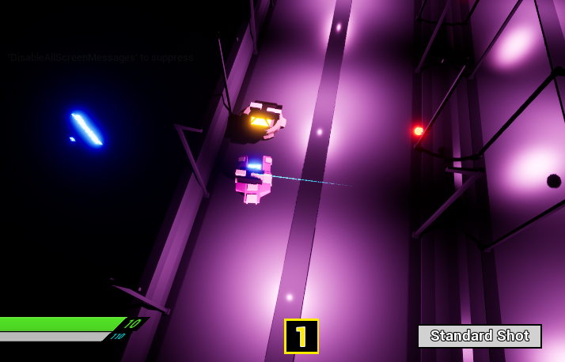

# Portfolio

## Finger Pistols

*[Solo project - Speedrunning platformer where your projectiles allow you to interact with the environment from a distance.](https://The-Ondeveloper.github.io/FingerPistols)*

## Ball on the Roll

*[Solo project - A game about rolling a ball through a winding level using a floating hand and protecting it from obstacles.](https://The-Ondeveloper.github.io/Ball-on-the-Roll)*

## The One Pirate

*[Solo project - A game made in Unity about hunting for treasure across the oceans as a pirate, all the while fighting off monsters on both land and sea.](https://The-Ondeveloper.github.io/TheOnePirate)*

## Top Down Turret

*[Solo project - A game made in a top down shooter framework, features a variety of weapons, RPG mechanics and branching upgrades for each weapon.](https://The-Ondeveloper.github.io/TopDownTurret)*

## Decent Dungeon 

*[Group project - Elder Scrolls inspired dungeon crawler - My role was developing the UI, inventory, and mechanics for the player character.](https://The-Ondeveloper.github.io/DecentDungeon)*
